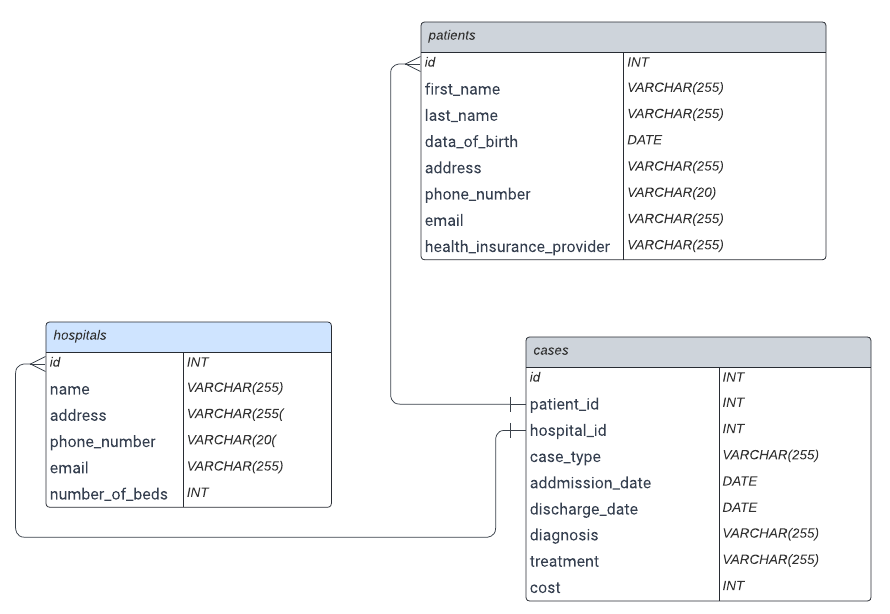

# Hospital Management System

The Hospital Management shared database is a shared database that is designed to manage patients and cases information across multiple hospitals. The system consists of three main tables: `patients`, `cases`, and `hospitals`. These three table are stored in shared database `Hospital_Digital_System` and shared among the hospitals.

In this example, the `patients` table includes a `hospital_id` column to indicate which hospital the patient is registered with, and the `cases` table includes both a `patient_id` and a `hospital_id` column to indicate which patient and hospital the case is associated with. This would allow both hospitals to share the same patient and case data, while still keeping track of which patients and cases belong to which hospital.

## Set Up

## Table Structure

### patients

| Field Name | Data Type | Key |
| --- | --- | --- |
| `id` | `INT` | Primary Key |
| `first_name` | `VARCHAR(255)` |  |
| `last_name` | `VARCHAR(255)` |  |
| `date_of_birth` | `DATE` |  |
| `address` | `VARCHAR(255)` |  |
| `phone_number` | `VARCHAR(20)` |  |
| `email` | `VARCHAR(255)` |  |
| `health_insurance_provider` | `VARCHAR(255)` |  |

### cases

| Field Name | Data Type | Key |
| --- | --- | --- |
| `id` | `INT` | Primary Key |
| `patient_id` | `INT` | Foreign Key (refers to `id` in `Patient`) |
| `hospital_id` | `INT` | Foreign Key (refers to `id` in `Hospital`) |
| `case_type` | `VARCHAR(255)` |  |
| `admission_date` | `DATE` |  |
| `discharge_date` | `DATE` |  |
| `diagnosis` | `VARCHAR(255)` |  |
| `treatment` | `VARCHAR(255)` |  |
| `cost` | `INT` |  |

### hospitals

| Field Name | Data Type | Key |
| --- | --- | --- |
| `id` | `INT` | Primary Key |
| `name` | `VARCHAR(255)` |  |
| `address` | `VARCHAR(255)` |  |
| `phone_number` | `VARCHAR(255)` |  |
| `email` | `VARCHAR(255)` |  |
| `number_of_beds` | `INT` |  |

## ER Model
The database for this project is structured according to the following ER diagram: 

## Data Contract for Hospital Management System

### Purpose

The purpose of this data contract is to provide a Python script for analyzing data in the Hospital Management System, which consists of three main tables: `patients`, `cases`, and `hospitals`. The script is intended to provide insights into patient demographics, case volume, and hospital performance.

### Script Description

The Python scripts included in these data contracts analyzes data from the `patients`, `cases`, and `hospitals` tables to produce the following metrics:

* Total number of patients
* Average age of patients
* Number of cases opened per month
* Number of cases opened by hospital
* Average cost for each hospital
* Percentage of cases with a given treatment
* Which health insurance providers are most commonly used by patients across all hospitals
* Number of patients per day with COVID19 diagnosis

The script accepts input parameters to filter the data and can be run by any Hospital to execute the script.

# Start Testing

## Hospital A
* Run script `hospital_A_script.sql` to create shared database , tables and insert data into tables.
* Run the command:
    * `CREATE DATABASE INVITE Hospital_Digital_System public_key=<HospitalB's Public_key>;`
* Run commnad:
    * `SELECT * FROM trustdble.encrypted_invite WHERE database_name='Hospital_Digital_System';`
* Create Json file in format:
    * `{"key":"453585...","iv":"cb3b63...","invite":"9a1491..."}`
* For creating table invite file:
    * `CREATE TABLE INVITE patients public_key=<HospitalB's Public_key>;`
* For fetching the encrypted invite for table run commnad:
    * `SELECT * FROM trustdble.encrypted_table_invite;`
* Create Json file for each table in format:
    * `{"invite":"9a1491..."}`
* For creating table invite file:
    * `CREATE TABLE INVITE hospitals public_key=<HospitalB's Public_key>;`
* For fetching the encrypted invite for table run commnad:
    * `SELECT * FROM trustdble.encrypted_table_invite;`
* Create Json file for each table in format:
    * `{"invite":"675436..."}`
* For creating table invite file:
    * `CREATE TABLE INVITE cases public_key=<HospitalB's Public_key>;`
* For fetching the encrypted invite for table run commnad:
    * `SELECT * FROM trustdble.encrypted_table_invite;`
* Create Json file for each table in format:
    * `{"invite":"567989..."}`
* Send the json files to Hospital B
* For creating the data contracts run the commands (change the absolute paths for logic_path parameters):
    * `CREATE DATA CONTRACT name=Average_age_of_patients logic_path=/path to/../trustdble-server/Example/Data_contract_logics/Average_age_of_patient.py owner=hospital user=Data-analysis-department parameters=Noparams;`

    * `CREATE DATA CONTRACT name=Average_cost_for_each_hospital logic_path=/path to/../trustdble-server/Example/Data_contract_logics/Average_cost_for_each_hospital.py owner=hospital user=Data-analysis-department parameters=Noparams;`

    * `CREATE DATA CONTRACT name=Most_used_health_insurance_provider logic_path=/path to/../trustdble-server/Example/Data_contract_logics/Most_used_health_insurance_provider.py owner=hospital user=Data-analysis-department parameters=Noparams;`

    * `CREATE DATA CONTRACT name=Nr_cases_of_each_hospital logic_path=/path to/../trustdble-server/Example/Data_contract_logics/Nr_cases_of_each_hospital.py owner=hospital user=Data-analysis-department parameters=Noparams;`

    * `CREATE DATA CONTRACT name=Nr_cases_per_month logic_path=/path to/../trustdble-server/Example/Data_contract_logics/Nr_cases_per_month.py owner=hospital user=Data-analysis-department parameters=Noparams;`

    * `CREATE DATA CONTRACT name=Percentage_cases_with_given_treatment logic_path=/path to/../trustdble-server/Example/Data_contract_logics/Percentage_cases_with_given_treatment.py owner=hospital user=Data-analysis-department parameters=treatment;`

    * `CREATE DATA CONTRACT name=Total_number_of_patients logic_path=/path to/../trustdble-server/Example/Data_contract_logics/Total_number_of_patients.py owner=hospital user=Data-analysis-department parameters=Noparams;`

    * `CREATE DATA CONTRACT name=Nr_patients_COVID_per_day logic_path=/path to/../trustdble-server/Example/Data_contract_logics/Nr_patients_COVID_per_day.py owner=hospital user=Data-analysis-department parameters=Noparams;`

  * Encrypt data contracts using Data-analysis-department's Publie key using these commands:
    * `ENCRYPT DATA CONTRACT name=Average_age_of_patients public_key=<Data-analysis-department's public key>;`
    * `ENCRYPT DATA CONTRACT name=Average_cost_for_each_hospital public_key=<Data-analysis-department's public key>;`
    * `ENCRYPT DATA CONTRACT name=Most_used_health_insurance_provider public_key=<Data-analysis-department's public key>;`
    * `ENCRYPT DATA CONTRACT name=Nr_cases_of_each_hospital public_key=<Data-analysis-department's public key>;`
    * `ENCRYPT DATA CONTRACT name=Nr_cases_per_month public_key=<Data-analysis-department's public key>;`
    * `ENCRYPT DATA CONTRACT name=Percentage_cases_with_given_treatment public_key=<Data-analysis-department's public key>;`
    * `ENCRYPT DATA CONTRACT name=Total_number_of_patients public_key=<Data-analysis-department's public key>;`
    * `ENCRYPT DATA CONTRACT name=Nr_patients_COVID_per_day public_key=<Data-analysis-department's public key>;`

  * Run below command to fetch the information about each data contract:
    * `SELECT * FROM trustdble.encrypted_data_contracts WHERE name='Average_age_of_patients';` 
    please run the command for each data contract that you need to fetch
  * Create a json file in below format:
    * `{"key":"453585...","iv":"cb3b63...","data_contract":"9a1491..."};`
* In the case to change the number of shards in database Hospital_Digital_System you can use the following command (in the script for creating the database we use 1 shard)
    * `REPARTITION SHARED DATABASE my_db shards=5;`

## Hospital B
* Run the following command to decrytpt the recieved invite file:
    * `ADD DATABASE INVITE encrypted_invite=<the json file recieved from Hospital A>;` 
* Run the following command to load the shared database Hospital_Digital_System:
    * `LOAD SHARED DATABASE Hospital_Digital_System;` 
    Now the database Hospital_Digital_System is shared between Hospital A and Hospital B
* For loading the tables run the following command for each encrypted invite table :
    * `ADD TABLE INVITE encrypted_invite=<encrypted invite>;`
* Run the following command to load the shared tables:
    * `LOAD SHARED TABLES;`
or
* Run the following commands for each table:
    * `LOAD SHARED TABLE patients;`
    * `LOAD SHARED TABLE hospitals;`
    * `LOAD SHARED TABLE cases;`

## Data-analysis-department
* Copy the content of `trustdble-server/server/build-debug/plugin/data_contracts/server_cert.pem` from Hospital A to `trustdble-server/server/build-debug/plugin/data_contracts/remote_server_cert.pem` in Data-analysis-department
* Run below command to decrypt the encrypted data contracts:
    * `ADD DATA CONTRACT encrypted_data_contract=<the json file recieved from Hospital A for each data contract>;`
* Data-analysis-department can see the data contracts content after decryption using following command:
    * `SELECT * FROM trustdble.remote_data_contracts;`
* For executing each data contract call call_data_contract function as below :
    * `SELECT call_data_contract("Average_age_of_patients","None");`
    * `SELECT call_data_contract("Average_cost_for_each_hospital","None");`
    * `SELECT call_data_contract("Most_used_health_insurance_provider","None");`
    * `SELECT call_data_contract("Nr_cases_of_each_hospital","None");`
    * `SELECT call_data_contract("Nr_cases_per_month","None");`
    * `SELECT call_data_contract("Percentage_cases_with_given_treatment","Stent");`
    * `SELECT call_data_contract("Total_number_of_patients","None");`
    * `SELECT call_data_contract("Nr_patients_COVID_per_day","None");`
* To see the results you can run the following command and use name of each data contract you need to see the result:
    * `SELECT * FROM trustdble.data_contracts_result WHERE name='Average_age_of_patients';`
